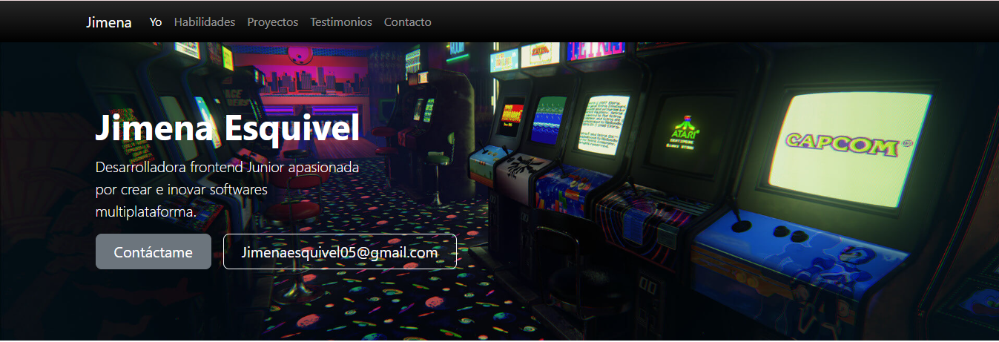
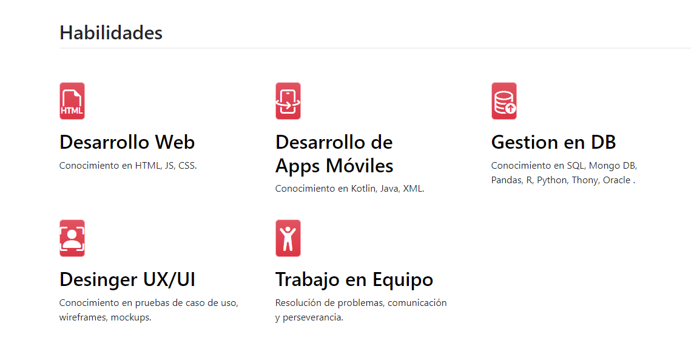
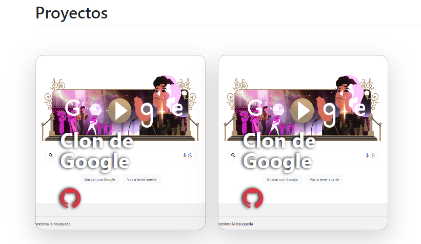

# Mi portafolio de habilidades TECNOLOCHICAS PRO

El presente proyecto es un portafolio desarrollado para poner en prática las
habilidades obtenidas del bootcamp de desarrollo frontend de Tecnolochicas PRO.

Fue desarrollado con HTML, CSS y JS con el uso de el framework de UI, Bootstrap
utilizando además bibliotecas externas.

La página es reponsiva (adabtable a diferentes tamaños de pantalla) e incluye la 
presentación de la autora del proyecto.

[Proyecto desplegado ()]

## Secciones de mi sitio 

* Header

* Main

* Footer

## Tecnologias

* HTML
* CSS 
* Bootstrap
* Javascript
---

Desarrollado con  💜 por [Jimena](https://ephemeral-begonia-57ac43.netlify.app/) en [TECHNOLOCHICAS PRO](https://tecnolochicas.mx/)
